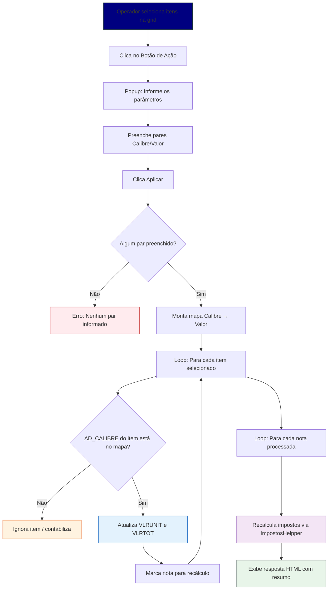

<p align="center">
  
</p>

<h1 align="center">BA-VLRUNITARIO-CALIBRE</h1>

<p align="center">
  <b>Botão de Ação — Atualização de Valores Unitários por Calibre</b><br>
  Módulo: Central de Vendas / Pedido de Vendas<br>
  Sankhya ERP — Grupo Argo
</p>

<p align="center">
  
  
  
  
</p>

---

## 📋 Sobre

Botão de ação customizado para a **Central de Vendas** que permite a atualização de valores unitários dos itens de um pedido de venda de forma agrupada por **calibre** (`AD_CALIBRE`).

O operador seleciona os itens na grid, e no popup de parâmetros informa até **5 pares** de calibre/valor unitário. O sistema aplica cada valor unitário somente nos itens cujo calibre (`AD_CALIBRE`) corresponde ao calibre informado, recalculando impostos automaticamente.

### Problema resolvido

Anteriormente, para alterar valores unitários por calibre, o operador precisava:
- Selecionar manualmente cada item ou grupo de itens do mesmo calibre
- Aplicar o valor unitário individualmente por calibre
- Repetir o processo para cada calibre presente no pedido

Com esta melhoria, **uma única ação** permite definir valores para até 5 calibres simultaneamente, reduzindo significativamente o tempo de lançamento.

---

## 📁 Estrutura do Projeto

```
BA-VLRUNITARIO-CALIBRE/
├── src/
│   └── br/
│       └── com/
│           └── argo/
│               └── controller/
│                   └── BtnPrincipalController.java   ← Classe principal (AcaoRotinaJava)
├── docs/
│   ├── changelog.md
│   ├── api.md
│   ├── architecture.md
│   ├── workflow.md
│   ├── security.md
│   └── integration.md
├── README.md                                         ← Este arquivo
└── BA-VLRUNITARIO-CALIBRE.jar                        ← JAR compilado para deploy
```

---

## 🏗️ Classe Principal

### `BtnPrincipalController.java`

| Atributo | Valor |
|----------|-------|
| **Pacote** | `br.com.argo.controller` |
| **Implementa** | `AcaoRotinaJava` |
| **Método principal** | `doAction(ContextoAcao ctx)` |
| **Módulo Sankhya** | 54 — `BA-VLRUNITARIO-CALIBRE` |
| **Classe Java** | `br.com.argo.controller.BtnPrincipalController` |
| **Recarregar após execução** | Os registros selecionados |

### Métodos

| Método | Descrição |
|--------|-----------|
| `doAction(ContextoAcao ctx)` | Entry point — lê parâmetros, filtra itens por calibre, atualiza valores e recalcula impostos |
| `atualizaCampos(BigDecimal, BigDecimal, BigDecimal, BigDecimal)` | Atualiza `VLRUNIT` e `VLRTOT` via `JapeFactory.dao("ItemNota")` |
| `getParamString(ContextoAcao, String)` | Lê parâmetro como String (null-safe) |
| `getParamBigDecimal(ContextoAcao, String)` | Lê parâmetro como BigDecimal (null-safe, suporta Double e String) |
| `AtualizaeVlrUnitario(...)` | Método legado via `NativeSql` (mantido para compatibilidade) |

---

## ⚙️ Parâmetros da Ação

Configurados no cadastro do Botão de Ação (Sankhya):

| # | Descrição | Nome | Tipo | Obrigatório | Casas Decimais |
|---|-----------|------|------|-------------|----------------|
| 1 | Vlr. unitário 01 | `VLRUNIT1` | Número decimal | Não | 2 |
| 2 | Calibre 01 | `CALIBRE1` | Texto | Não | — |
| 3 | Vlr. Unitário 02 | `VLRUNIT2` | Número decimal | Não | 2 |
| 4 | Calibre 02 | `CALIBRE2` | Texto | Não | — |
| 5 | Vlr. unitário 03 | `VLRUNIT3` | Número decimal | Não | 2 |
| 6 | Calibre 03 | `CALIBRE3` | Texto | Não | — |
| 7 | Vlr. unitário 04 | `VLRUNIT4` | Número decimal | Não | 2 |
| 8 | Calibre 04 | `CALIBRE4` | Texto | Não | — |
| 9 | Vlr. unitário 05 | `VLRUNIT5` | Número decimal | Não | 2 |
| 10 | Calibre 05 | `CALIBRE5` | Texto | Não | — |

> **Nota:** Pares não preenchidos são ignorados automaticamente. O operador preenche apenas os calibres que deseja atualizar.

---

## 🗃️ Tabelas Envolvidas

| Tabela | Alias | Operação | Descrição |
|--------|-------|----------|-----------|
| `TGFITE` | ItemNota | **UPDATE** | Atualiza `VLRUNIT` e `VLRTOT` dos itens filtrados |
| `TGFCAB` | CabecalhoNota | **READ** | Leitura indireta via `ImpostosHelpper` para recálculo |
| `TGFITE` | ItemNota | **READ** | Leitura do campo `AD_CALIBRE` para filtro |

### Campo Customizado

| Campo | Tabela | Tipo | Descrição |
|-------|--------|------|-----------|
| `AD_CALIBRE` | `TGFITE` | VARCHAR | Calibre do item (ex: 07, 08, 10, 12) |

---

## 🔄 Fluxo de Execução



---

## 📊 Exemplo de Uso

### Cenário: Nota 745127 (Exportação — DOLE IBERIA)

**Itens selecionados (6 registros):**

| Seq | Calibre | Produto | Qtd |
|-----|---------|---------|-----|
| 1 | 07 | MANGA PALMER 4KG ARGO (FRESCAS) ME | 2.520 |
| 2 | 08 | MANGA PALMER 4KG ARGO (FRESCAS) ME | — |
| 3 | 08 | MANGA PALMER 4KG ARGO (FRESCAS) ME | — |
| 4 | 08 | MANGA PALMER 4KG ARGO (FRESCAS) ME | — |
| 5 | 10 | MANGA PALMER 4KG ARGO (FRESCAS) ME | — |
| 6 | 12 | MANGA PALMER 4KG ARGO (FRESCAS) ME | — |

**Parâmetros informados:**

| Par | Calibre | Vlr Unitário |
|-----|---------|--------------|
| 1 | 07 | 600,00 |
| 2 | 08 | 500,00 |
| 3 | 10 | 400,00 |
| 4 | 12 | 350,00 |
| 5 | *(vazio)* | *(vazio)* |

**Resultado:**
- Calibre 07 → 1 item atualizado com R$ 600,00
- Calibre 08 → 3 itens atualizados com R$ 500,00
- Calibre 10 → 1 item atualizado com R$ 400,00
- Calibre 12 → 1 item atualizado com R$ 350,00
- Impostos recalculados 1x (nota 745127)
- Total: 6 atualizados, 0 ignorados

---

## 🚀 Deploy

### Pré-requisitos

- Sankhya ERP com módulo Central de Vendas (Módulo 54)
- Campo `AD_CALIBRE` cadastrado na `TGFITE` (Dicionário de Dados)
- Java 8+ no ambiente Sankhya

### Passos

1. **Compilar o JAR**
   ```bash
   # Compilar com as dependências do Sankhya no classpath
   javac -cp "sankhya-libs/*" -d bin src/br/com/argo/controller/BtnPrincipalController.java
   jar cf BA-VLRUNITARIO-CALIBRE.jar -C bin .
   ```

2. **Upload do JAR**
   - Acesse: `Módulos > Botão de Ação > BA-VLRUNITARIO-CALIBRE`
   - Clique em **"Baixar biblioteca de extensões"** para upload do JAR

3. **Configurar parâmetros**
   - Cadastre os 10 parâmetros conforme a tabela da seção [Parâmetros da Ação](#⚙️-parâmetros-da-ação)
   - Todos como **Não obrigatório**
   - `VLRUNIT1..5` → Número decimal, 2 casas
   - `CALIBRE1..5` → Texto

4. **Vincular ao módulo**
   - Módulo: `54`
   - Classe Java: `br.com.argo.controller.BtnPrincipalController`
   - Depois de executar, recarregar: `Os registros selecionados`

5. **Testar**
   - Central de Vendas → Pedido de Vendas → Aba Itens
   - Selecione itens com calibres variados
   - Execute o botão e valide valores e impostos

---

## 📝 Observações

1. **Compatibilidade retroativa:** O método `AtualizaeVlrUnitario` (NativeSql) foi mantido no código para compatibilidade mas não é usado no fluxo principal. O método `atualizaCampos` (JapeFactory) é o utilizado.

2. **Otimização de impostos:** O recálculo de impostos (`ImpostosHelpper`) é feito **uma vez por nota**, não por item. Se o operador selecionar 20 itens da mesma nota, o recálculo acontece apenas 1 vez.

3. **Limite de 5 calibres:** Suporta até 5 calibres simultâneos. Para frutas de exportação (manga), os calibres comuns são 07, 08, 10, 12, 14 — o limite de 5 cobre a maioria dos cenários.

4. **Pares vazios:** Se o operador preencher apenas 2 dos 5 pares, os outros 3 são ignorados automaticamente sem erro.

5. **Validação de calibre:** O match é por igualdade exata (string). Calibre `"08"` ≠ `"8"`. O operador deve digitar o calibre exatamente como está cadastrado no `AD_CALIBRE`.

---

## 📜 Changelog

| Versão | Data | Tipo | Descrição |
|--------|------|------|-----------|
| 1.0.0 | 2026-04-13 | `feat` | Versão inicial — valor único para todos os itens |
| 2.0.0 | 2026-04-14 | `feat` | Atualização por calibre com 5 pares de parâmetros |
| 2.0.1 | 2026-04-14 | `fix` | Correção de sintaxe no parâmetro AD_CALIBRE |
| 2.1.0 | 2026-04-14 | `refactor` | Otimização do recálculo de impostos (1x por nota) |

---

## 👤 Autor

| | |
|---|---|
| **Desenvolvedor** | Natan — Grupo Argo (Argo Fruta) |
| **Módulo** | Central de Vendas — Sankhya ERP |
| **Contato** | natanael.lopes@argofruta.com |

---

<p align="center">
  
  <br>
  <sub>Grupo Argo — Desenvolvimento ERP Sankhya</sub>
</p>
